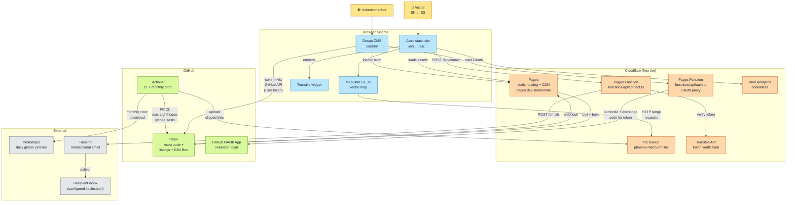
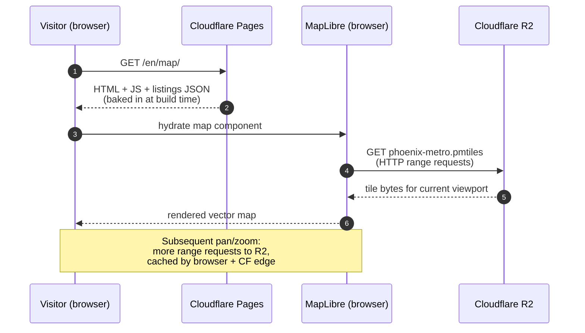
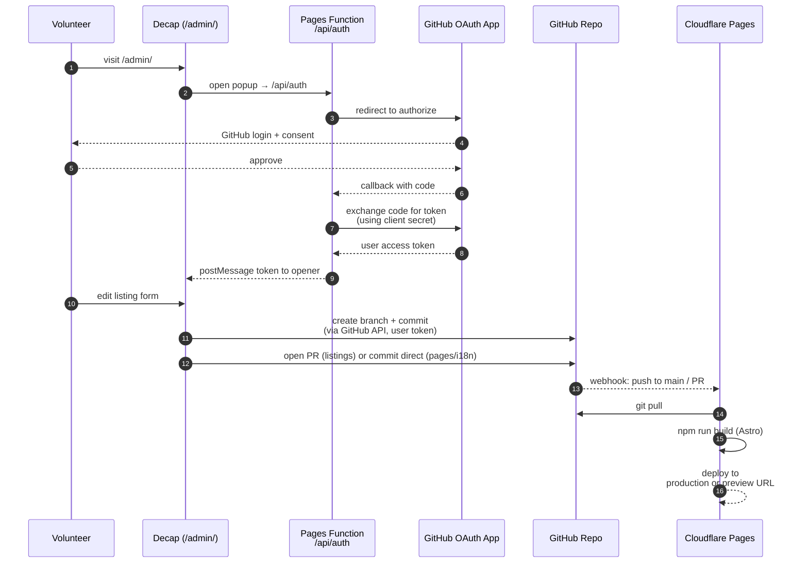
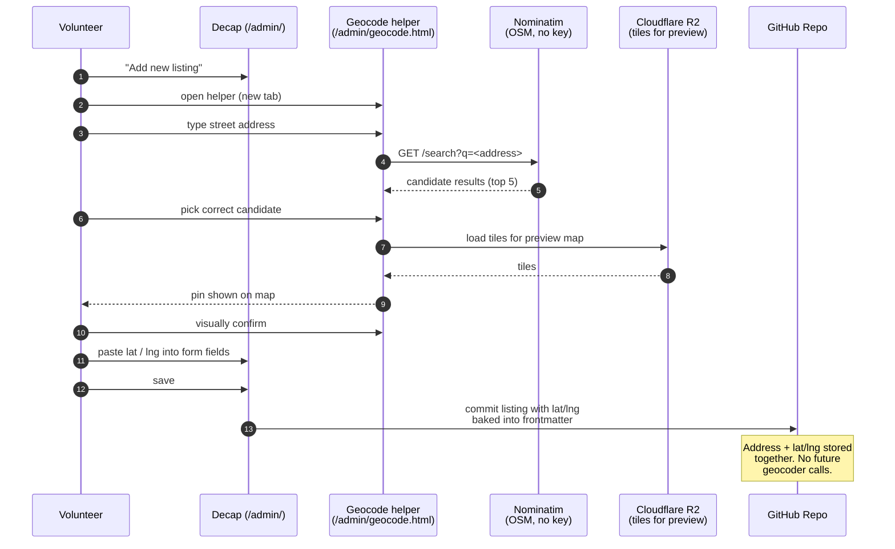
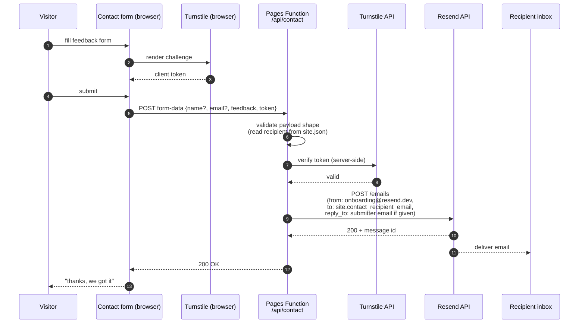
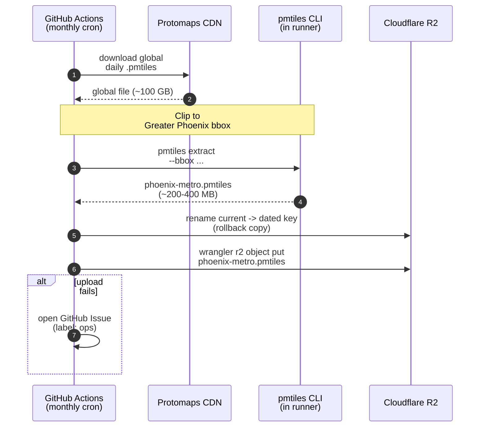

# Architecture

Visual overview of how the pieces described in [DECISIONS.md](./DECISIONS.md) and [PLAN.md](./PLAN.md) fit together at runtime.

---

## System overview

Shows every moving part and who talks to whom. Colors group components by trust boundary.

---

## Flow: visitor loads the map view

The hot path for most users. Everything is static or cached; no backend involvement.

---

## Flow: volunteer edits a listing

Decap runs entirely in the browser; a tiny Pages Function proxies the OAuth token exchange so the client secret never leaves the server.

---

## Flow: volunteer adds a new listing (with geocoding)

The one time an address turns into coordinates. Happens once per listing and never again.

---

## Flow: contact form submission

Only path in the system that runs server-side code at request time.

---

## Flow: monthly map tile refresh

Scheduled automation, no human in the loop unless it fails.

---

## Trust boundaries & secrets

- **No user PII stored by the site.** The contact form submitter can stay anonymous. Any name/email they provide is emailed once to the configured recipient inbox and never persisted by our infrastructure.
- **Three shared secrets**, all encrypted Cloudflare Pages env vars, all rotatable in seconds:
  1. **`RESEND_API_KEY`** — used server-side by `functions/api/contact.ts` to POST feedback emails to Resend.
  2. **`TURNSTILE_SECRET`** — used server-side by `functions/api/contact.ts` to verify the client-issued Turnstile token before sending.
  3. **GitHub OAuth App client secret** — used server-side by `functions/api/auth.ts` to exchange volunteer login codes for user access tokens.
- **`PUBLIC_TURNSTILE_SITE_KEY`** is a plain (non-secret) Pages env var, baked into the built HTML for the Turnstile widget.
- **R2 bucket** is public-read for the tile file only. No write path reachable from the browser.
- **Cloudflare Web Analytics** is cookieless and stores no PII — no cookie banner required.

## What this architecture buys us

- **Zero always-on servers.** The only code that runs per-request is the contact Pages Function; everything else is static files served from the edge.
- **Compromise blast radius is small.** Losing a secret = rotate in the issuer (Resend / Cloudflare Turnstile / GitHub) and update the Pages env var. There's no user database to leak.
- **Costs don't scale with traffic.** CF Pages bandwidth is unlimited, R2 egress is free, Pages Functions have a generous free request quota. A viral moment doesn't produce a bill.
- **Every component is swappable.** R2 → any S3-compatible store. Protomaps → MapTiler. Decap → direct git editing or Sveltia. GitHub → GitLab. No component is load-bearing beyond what it directly does.
